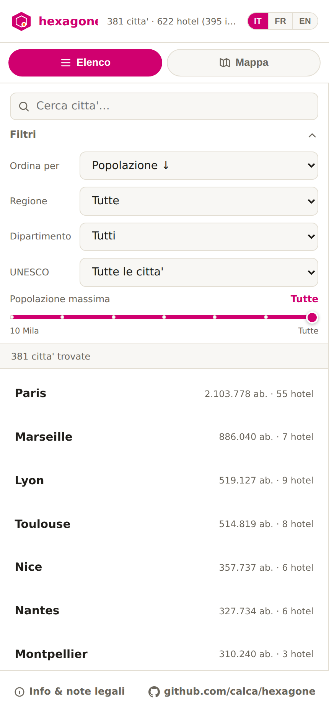

# hexagone — mappa degli hotel ibis e ibis Styles in Francia

[](https://calca.github.io/hexagone/)
[](LICENSE)

### 🌐 [calca.github.io/hexagone](https://calca.github.io/hexagone/) — 📦 [github.com/calca/hexagone](https://github.com/calca/hexagone)

**hexagone** è una mappa interattiva, gratuita e open source, di tutti gli
hotel **ibis** e **ibis Styles** in Francia — oltre 600 hotel in più di 380
città. Per ogni città mostra popolazione, cenni storici, cosa visitare in
un giorno ed eventuali siti UNESCO o monumenti storici nelle vicinanze,
cosi' puoi decidere dove dormire sapendo anche cosa c'e' intorno all'hotel.

Non è un sito ufficiale Accor/ibis: è un progetto indipendente che
raccoglie ed espone dati pubblici (OpenStreetMap, dati del governo
francese, Wikipedia/Wikivoyage, Wikidata) in un'unica mappa consultabile.

<table>
<tr>
<td width="50%">

</td>
<td width="50%">

</td>
</tr>
</table>

## Cosa puoi fare con hexagone

- 🗺️ **Mappa interattiva** con tutti gli hotel ibis e ibis Styles di
  Francia, raggruppati per città
- 🔍 **Filtri** per regione, dipartimento, popolazione massima e presenza
  di un sito UNESCO, più ricerca libera per nome
- 🏛️ **Cenni storici, cosa visitare in un giorno, siti UNESCO e monumenti
  storici** per ogni città, con foto da Wikimedia Commons
- 🔗 **Link diretti** per prenotare su ibis.com o Booking.com, o per
  aprire l'hotel su Google Maps
- 🔗 **Un URL per ogni città** (`/citta/lyon`), condivisibile e con anteprima link
- 🌍 **Interfaccia in italiano, francese e inglese**
- 📱 **Installabile come app (PWA)**, funziona anche offline
- 📊 **Dati sempre aggiornati**: una pipeline automatica rigenera il
  dataset ogni settimana

---

## 🛠️ Documentazione tecnica

Pipeline Python + sito statico. La pipeline scarica ed elabora i dati da
piu' fonti pubbliche, il sito statico li consuma da un unico file
`docs/data.json`.

- **Dati hotel**: OpenStreetMap (Overpass API) — licenza ODbL
- **Risoluzione del comune di appartenenza di ogni hotel** (per nome o per coordinate): API geografica del governo francese ([geo.api.gouv.fr](https://geo.api.gouv.fr/)) — dati pubblici INSEE/IGN, licenza Etalab Open Licence 2.0
- **Indirizzo degli hotel senza `addr:street` su OSM**: reverse geocoding via [api-adresse.data.gouv.fr](https://api-adresse.data.gouv.fr/) (Base Adresse Nationale) — licenza Etalab Open Licence 2.0
- **Popolazione**: Wikidata (SPARQL) — licenza CC0
- **Storia e attrazioni**: Wikipedia e Wikivoyage in francese — licenza CC BY-SA
- **Monumenti storici classificati/iscritti**: Base Merimee, Ministero della Cultura francese, via [data.culture.gouv.fr](https://data.culture.gouv.fr/) — licenza Etalab Open Licence 2.0
- **Siti UNESCO**: lista statica curata a mano (`data/unesco_sites_fr.json`, non esaustiva — solo i siti che corrispondono a un singolo comune), non una fonte live
- **Frontend**: HTML/CSS/JS statico con mappa Leaflet (vendorizzata in `docs/vendor/`, nessuna dipendenza da CDN esterne), pubblicabile su GitHub Pages
- **Lingua**: interfaccia disponibile in italiano/francese/inglese (selettore in alto, persistito in `localStorage`); i contenuti delle citta' (storia, attrazioni), essendo estratti da Wikipedia/Wikivoyage in francese, restano in francese in ogni lingua — vedi [Lingua dell'interfaccia](#lingua-dellinterfaccia)
- **Licenza**: [MIT](LICENSE) per codice e sito. I dati restano soggetti alle licenze delle rispettive fonti (ODbL / Etalab / CC0 / CC BY-SA elencate sopra).

### Struttura del progetto

```
scripts/
  overpass_client.py    client HTTP verso Overpass API (con failover su piu' mirror)
  fetch_hotels.py        step 1: scarica gli hotel ibis/ibis Styles in Francia
  resolve_cities.py      step 2: raggruppa per comune, risolve INSEE via geo.api.gouv.fr
                          (per nome, o per coordinate per hotel senza addr:city, con
                          cache resumibile su disco)
  enrich_addresses.py    step 3: riempie l'indirizzo degli hotel senza addr:street su OSM
                          via reverse geocoding (api-adresse.data.gouv.fr), con cache
                          resumibile su disco
  enrich_wikidata.py     step 4: popolazione via SPARQL (batch)
  enrich_heritage.py     step 5: siti UNESCO (lista statica) e monumenti storici
                          (data.culture.gouv.fr), con cache resumibile su disco
  enrich_wikimedia.py    step 6: storia (Wikipedia) e attrazioni (Wikivoyage), con cache
  build_dataset.py       step 7: genera docs/data.json (il "DB" del sito)
  pipeline.py            esegue tutti gli step in sequenza
data/
  unesco_sites_fr.json   lista statica curata a mano dei siti UNESCO francesi
                          (solo quelli mappabili a un singolo comune)
docs/                    sito statico (GitHub Pages), installabile come PWA
  index.html / style.css / app.js
  app.js                   include anche il dizionario di traduzione IT/FR/EN e il routing per citta'
  about.html / about.js    pagina "Info & note legali" (fonti dati, disclaimer di non affiliazione)
                            con il proprio dizionario di traduzione IT/FR/EN
  404.html                 redirect per gli URL /citta/{id} (vedi "URL per citta'" sotto)
  manifest.webmanifest     manifest PWA (nome, icone, colori)
  sw.js                    service worker (cache offline dell'app shell + dati)
  icons/                   favicon e icone dell'app (incl. varianti maskable)
  data.json               dataset consumato dal frontend, rigenerato periodicamente dalla pipeline
  sitemap.xml              generata da build_dataset.py, un URL per citta' + home + about
  vendor/leaflet/          libreria Leaflet vendorizzata
.github/workflows/
  refresh-data.yml        rigenera docs/data.json (schedulato + manuale) e lo committa
  pages.yml               pubblica docs/ su GitHub Pages ad ogni push su main
```

### Eseguire la pipeline in locale

Il file `docs/data.json` gia' presente nel repo contiene il dataset reale
(non dati di esempio), rigenerato automaticamente ogni settimana dalla
GitHub Action `refresh-data.yml`. Devi eseguire la pipeline tu stesso solo
se vuoi rigenerarlo manualmente o personalizzarlo:

```bash
python -m venv .venv && source .venv/bin/activate
pip install -r requirements.txt

# esecuzione completa (hotel -> citta' -> popolazione -> storia/attrazioni -> dataset)
python scripts/pipeline.py

# giro veloce senza storia/attrazioni (piu' rapido, utile per iterare)
python scripts/pipeline.py --skip-wikimedia

# riesegue solo uno step (usa i file gia' presenti in data/cache/)
python scripts/pipeline.py --only wikidata
```

Il risultato finale e' scritto in `docs/data.json`. I file intermedi (in
`data/cache/`, non versionati) permettono di riprendere/ripetere singoli
step senza rifare tutto da capo.

Tempo indicativo: la fase Overpass richiede qualche minuto, l'arricchimento
Wikipedia/Wikivoyage (uno per citta') e' la piu' lenta — con ~250-350
citta' puo' richiedere 5-15 minuti (rate limiting incluso per rispettare
le policy di Wikimedia/OSM).

### Pubblicare su GitHub Pages

1. Fai push del branch su GitHub e fai merge su `main`.
2. In **Settings → Pages**, imposta *Source: GitHub Actions* (il workflow
   `pages.yml` e' gia' pronto e pubblica automaticamente la cartella `docs/`
   ad ogni push su `main`).
3. Per aggiornare i dati periodicamente, il workflow `refresh-data.yml`
   gira ogni lunedi' alle 03:00 UTC (o puoi lanciarlo manualmente da
   Actions → *Refresh dataset* → *Run workflow*): esegue la pipeline con
   accesso internet completo (i runner GitHub Actions non hanno le
   restrizioni di rete di eventuali sandbox), e se `docs/data.json` cambia
   lo committa su `main`, il che fa scattare automaticamente un nuovo
   deploy di Pages.

### Schema di `docs/data.json`

```jsonc
{
  "generated_at": "2026-08-11T...",
  "stats": { "cities": 250, "hotels": 480, "ibis": 400, "ibis_styles": 80 },
  "cities": [
    {
      "id": "paris",
      "name": "Paris",
      "insee": "75056",
      "wikidata": "Q90",
      "lat": 48.8566, "lon": 2.3522,
      "population": 2133111,
      "population_year": "2021",
      "history_summary": "...",
      "attractions": ["Torre Eiffel", "..."],
      "unesco_sites": [{ "name": "Rive della Senna a Parigi", "year": 1991 }],
      "monuments_historiques": ["Notre-Dame de Paris", "..."],
      "wikipedia_url": "https://fr.wikipedia.org/wiki/Paris",
      "hotel_count": 12,
      "hotels": [
        { "osm_id": "node/123", "name": "ibis Paris Bastille", "brand": "ibis",
          "address": "...", "postcode": "75011", "lat": 48.85, "lon": 2.37,
          "phone": null, "website": null }
      ]
    }
  ]
}
```

Nel frontend, la **popolazione** e' la colonna usata per ordinare/filtrare
l'elenco citta' (campo "Popolazione massima" e ordinamento nella sidebar).

### Lingua dell'interfaccia

L'interfaccia (etichette, filtri, pannello di dettaglio, pagina Info) e'
disponibile in italiano, francese e inglese tramite il selettore IT/FR/EN
nella topbar; la scelta viene salvata in `localStorage` (`hexagone-lang`)
ed e' condivisa tra `index.html` e `about.html`.

I **contenuti** delle citta' (cenni storici, cosa visitare) restano invece
sempre in francese, indipendentemente dalla lingua scelta: sono estratti
cosi' come sono da Wikipedia/Wikivoyage in francese durante la pipeline
(`enrich_wikimedia.py`), e tradurli richiederebbe query aggiuntive verso
le wiki in italiano/inglese (con copertura scarsa o assente per i comuni
francesi minori) oppure un servizio di traduzione automatica a pagamento —
non sostenibile per un sito statico senza backend. I nomi propri geografici
(regioni, dipartimenti, comuni) non vengono tradotti per convenzione.

Le stringhe di traduzione vivono in due dizionari JS separati (uno per
pagina, senza dipendenze esterne ne' passo di build):
`docs/app.js` (oggetto `TRANSLATIONS`) per l'app principale e
`docs/about.js` per la pagina Info & note legali.

### URL per città

Ogni città ha un URL proprio, condivisibile: `https://calca.github.io/hexagone/citta/{id}`
(es. `/citta/lyon`) apre direttamente la scheda di quella città. E' un
routing **client-side** (niente pagine HTML separate per città): l'app
resta una SPA, ma usa la History API per URL puliti invece di un hash o
un parametro di query, aggiornando titolo/meta description/canonical/OG
via JavaScript quando si apre una scheda.

Poiché GitHub Pages non supporta un vero routing lato server, un
accesso diretto a `/citta/lyon` (link condiviso, refresh della pagina)
passa dal trucco standard delle SPA su GitHub Pages: `docs/404.html`
(servito per qualunque path senza un file corrispondente) ricodifica il
path in una query string e rimanda a `index.html`, che la decodifica e
la riscrive pulita con `history.replaceState()` prima di avviare l'app
(vedi i commenti in cima a `docs/app.js` e in `docs/404.html`).

**Limite noto**: la risposta HTTP iniziale per `/citta/lyon` è comunque
uno status 404 (il redirect avviene lato client, dopo), quindi
l'indicizzazione da parte di Google dipende dal fatto che esegua il
JavaScript della pagina — cosa che fa nella maggior parte dei casi, ma
non è garantita al 100%. L'alternativa più robusta (pagine HTML statiche
pre-generate per città, con contenuto già nel markup e uno status 200
diretto) è stata scartata per ora a favore di questo approccio, più
semplice da mantenere su un sito senza build step.

La sitemap (`docs/sitemap.xml`) è generata da `build_dataset.py` ad ogni
refresh del dataset, con un URL per ogni città oltre a home e about.

### Limiti noti

- La corrispondenza citta' → comune ufficiale (per popolazione/INSEE) si
  basa sul nome (`addr:city` dell'hotel) disambiguato per dipartimento e,
  in subordine, per vicinanza geografica: casi limite (comuni omonimi nello
  stesso dipartimento, frazioni non censite come comune) potrebbero non
  risolversi e restano nel dataset con popolazione/storia mancanti invece
  di essere scartati.
- "Cosa visitare in un giorno" dipende dalla presenza e qualita' della
  sezione "Voir" nella pagina Wikivoyage francese della citta'; per centri
  minori potrebbe essere vuoto.
- Rispetta le policy di utilizzo di Overpass API e Wikimedia (User-Agent
  identificativo gia' impostato negli script, non aumentare la frequenza
  delle richieste).
- La lista dei siti UNESCO (`data/unesco_sites_fr.json`) e' curata a mano e
  non esaustiva: copre solo i siti che corrispondono chiaramente a un
  singolo comune (niente siti seriali su decine di comuni ne' siti
  naturali), e non e' garantita aggiornata alle ultime iscrizioni UNESCO.
- I campi (nomi) usati dall'API dei monumenti storici (data.culture.gouv.fr)
  non sono verificati contro una risposta live in fase di sviluppo: se il
  formato del dataset cambia, `enrich_heritage.py` logga un avviso e
  prosegue senza quel dato invece di far fallire la pipeline (vedi i log
  della Action "Refresh dataset" per diagnosticare).

## Licenza

Codice e sito sono rilasciati con licenza [MIT](LICENSE). I dati mostrati
provengono da fonti terze con licenze proprie e vanno attribuiti di
conseguenza: OpenStreetMap (ODbL), geo.api.gouv.fr / data.culture.gouv.fr
(Etalab Open Licence 2.0), Wikidata (CC0), Wikipedia/Wikivoyage in
francese (CC BY-SA) — vedi i link diretti nella scheda di ogni citta' sul
sito.
